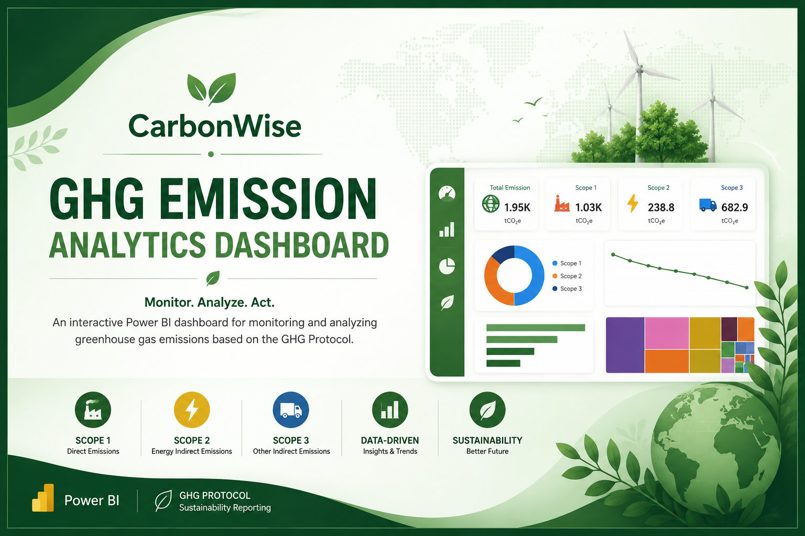
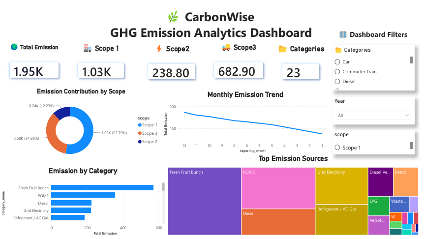

# 🌿 CarbonWise – GHG Emission Analytics Dashboard




## 📌 Project Overview

CarbonWise is an interactive Power BI dashboard developed to monitor and analyze greenhouse gas (GHG) emissions based on the GHG Protocol. The dashboard provides insights into Scope 1, Scope 2, and Scope 3 emissions through KPI monitoring, trend analysis, category analysis, and interactive filtering to support sustainability reporting and data-driven decision making.

---

## 🎯 Objectives

- Monitor greenhouse gas emissions across Scope 1, Scope 2, and Scope 3.
- Analyze emission trends over time.
- Identify major emission sources and categories.
- Support sustainability reporting using interactive business intelligence dashboards.

---

## 📂 Dataset

This project uses a representative GHG emissions dataset for portfolio purposes.

Dataset includes:

- Emission Category
- Scope (1, 2, and 3)
- Emission Factor
- Emission Result (tCO₂e)
- Reporting Year
- Reporting Month

---

## 📊 Dashboard Preview

### Dashboard Overview



---

## 📈 Dashboard Features

- Executive KPI Cards
- Scope 1, Scope 2, and Scope 3 Monitoring
- Monthly Emission Trend
- Emission Contribution by Scope
- Top Emission Sources
- Emission Category Analysis
- Interactive Filters
- Sustainability Reporting Dashboard

---

## 💡 Key Business Insights

- Scope 1 contributes the largest proportion of total greenhouse gas emissions.
- Fresh Fruit Bunch, POME, and Grid Electricity are among the major emission sources.
- Monthly emission trends help identify changes in operational emissions over time.
- Interactive filtering enables users to analyze emissions by category, reporting year, and emission scope.

---

## 🛠 Tools & Technologies

- Power BI Desktop
- DAX
- Power Query
- Microsoft Excel
- Data Visualization
- Business Intelligence

---

## 📁 Repository Structure

```
carbonwise-ghg-emission-analytics
│
├── CarbonWise_GHG_Emission_Analytics.pbix
├── CarbonWise_GHG_Emission_Analytics.pdf
├── Dashboard_Overview.png
├── Cover.png
└── README.md
```

---

## 🚀 Project Output

- Interactive Power BI Dashboard
- Executive KPI Monitoring
- Sustainability Reporting Dashboard
- Business Intelligence Visualization

---

## 👨‍💻 Author

**Haflatul Huda Ali**

- LinkedIn: https://www.linkedin.com/in/hafla-ali/
- GitHub: https://github.com/haflaali20
